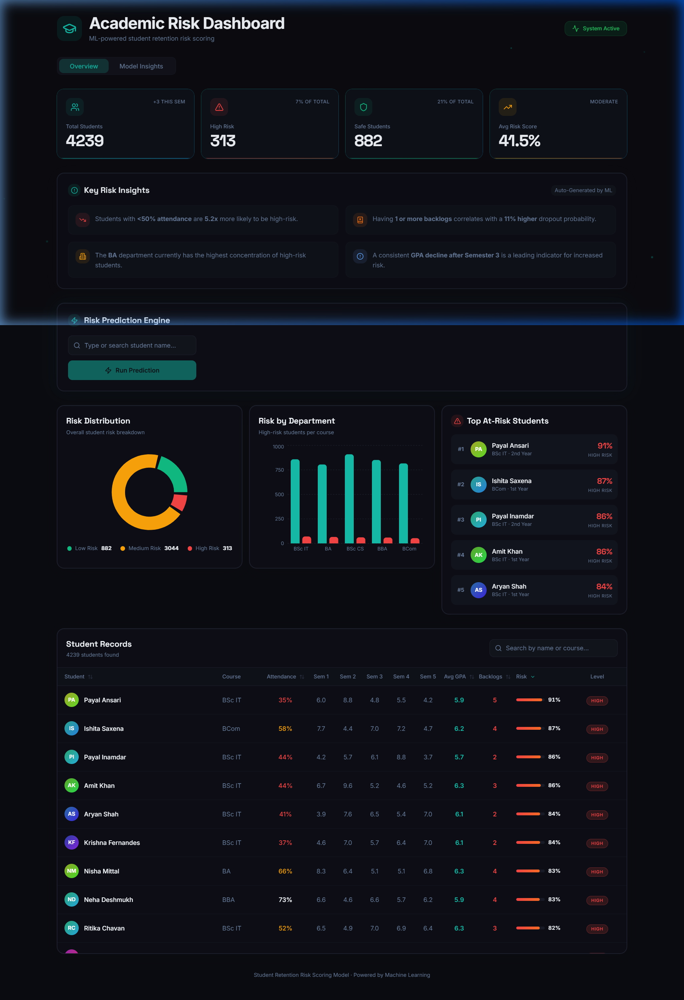
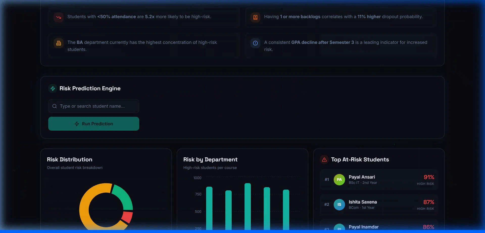
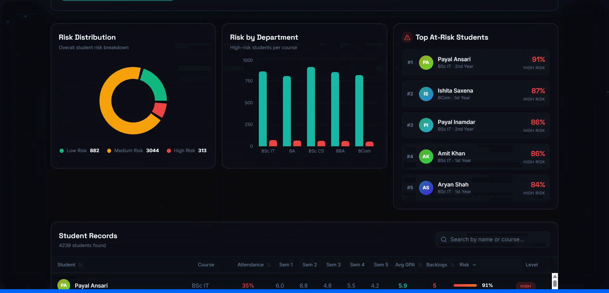

# Student Retention Risk Prediction Dashboard 🎓

## Problem Statement
Student dropout rates are a significant challenge for educational institutions worldwide. When struggling students are not identified and supported early enough, they may drop out, which negatively impacts both their future prospects and the institution's retention metrics. Predicting dropout risk early allows educators and administrators to proactively intervene, provide targeted support, and ultimately improve student success rates.

## Features ✨
- **Student Dataset Viewer**: Browse and filter comprehensive student records including academic performance and demographics.
- **Dropout Risk Prediction Engine**: Real-time risk scoring for individual students based on machine learning models.
- **GPA Trend Analysis**: Visualize historical GPA data to identify declining academic performance trajectories.
- **Attendance vs. Risk Visualization**: Understand the correlation between class attendance and overall dropout probability.
- **Backlog Impact Analysis**: Analyze how current and cleared backlogs affect a student's likelihood of retention.
- **Feature Importance Visualization**: Transparent AI that explains which factors (e.g., attendance, GPA, backlogs) are driving the risk predictions.

## Tech Stack 🛠️

### Frontend
- React
- TypeScript
- Vite
- Tailwind CSS
- Recharts (for data visualization)

### Backend
- Python
- Flask
- scikit-learn
- pandas
- numpy
- joblib

### Deployment
- **Frontend**: Deployed on Vercel
- **Backend**: Deployed on Render

## Machine Learning Model 🧠
The core prediction engine is powered by a **Random Forest** classification model. This ensemble learning method leverages a multitude of decision trees during training to output highly accurate dropout risk predictions. The model was trained on historical student data, capturing complex non-linear relationships across varying academic and engagement metrics.

## System Architecture 🏗️
The client-server architecture isolates the machine learning compute from the user interface:
1. The **React/TypeScript Frontend** provides an interactive dashboard for users.
2. The frontend sends user requests (data queries or prediction requests) via HTTP to the **Flask API**.
3. The Flask API receives the request, processes the input data using `pandas`/`numpy`, and feeds it into the pre-trained Random Forest model loaded via `joblib`.
4. The model returns a risk prediction (Low, Medium, or High risk), which the Flask API sends back to the frontend to be visualized dynamically.

## Project Structure 📂
```text
student-retention-risk-dashboard/
├── student_Dashboard/          # Frontend React application (Vite)
│   ├── src/                    # UI Components, hooks, and services
│   ├── public/                 # Static assets (favicons, etc.)
│   └── package.json            # Node.js dependencies
├── api/                        # (or backend scripts) Python backend logic
├── model/                      # Trained machine learning model files (.pkl / .joblib)
├── dataset/                    # Training and testing datasets (.csv)
├── app.py                      # Main Flask application entry point
└── requirements.txt            # Python dependencies
```

## How to Run Locally 🚀

### 1. Backend Setup
First, ensure you have Python installed. Navigate to the root directory and install the dependencies:
```bash
pip install -r requirements.txt
python app.py
```
The Flask server should now be running locally on `http://127.0.0.1:5000`.

### 2. Frontend Setup
Open a new terminal window, navigate to the frontend directory, install the dependencies, and start the development server:
```bash
cd student_Dashboard
npm install
npm run dev
```
The Vite development server will start, usually accessible at `http://localhost:5173` (or the port specified in the console).

## Live Demo 🌐
**[Insert Deployed Vercel Link Here]**

## Screenshots 📸

### Dashboard Overview


### Student Risk Prediction


### Data Visualizations


## Future Improvements 🔮
- **Integration with Real Institutional Datasets**: Connect the application to real-world SIS (Student Information Systems) or LMS (Learning Management Systems).
- **Model Retraining Pipeline**: Implement an automated pipeline to securely ingest new student data and retrain the model periodically, preventing data drift.
- **Authentication for Faculty Users**: Add secure login functionality (e.g., JWT, OAuth) with role-based access control (RBAC) ensuring data privacy.
