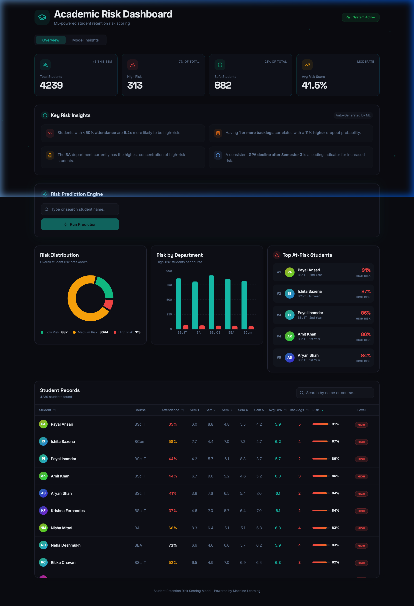
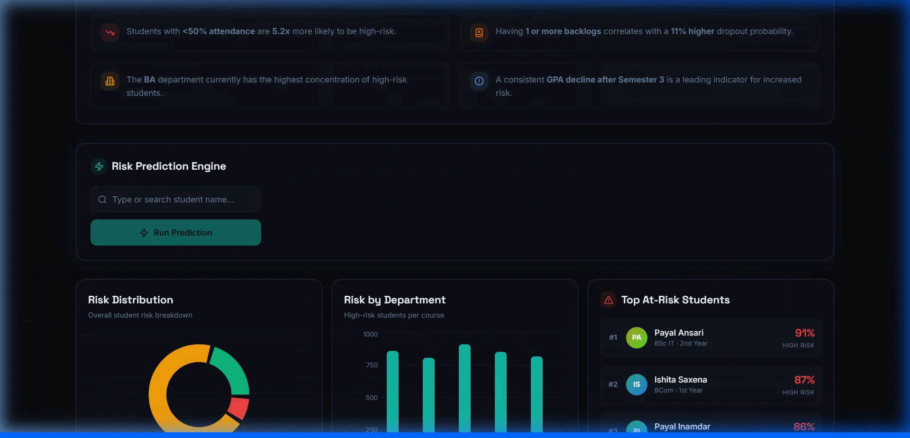
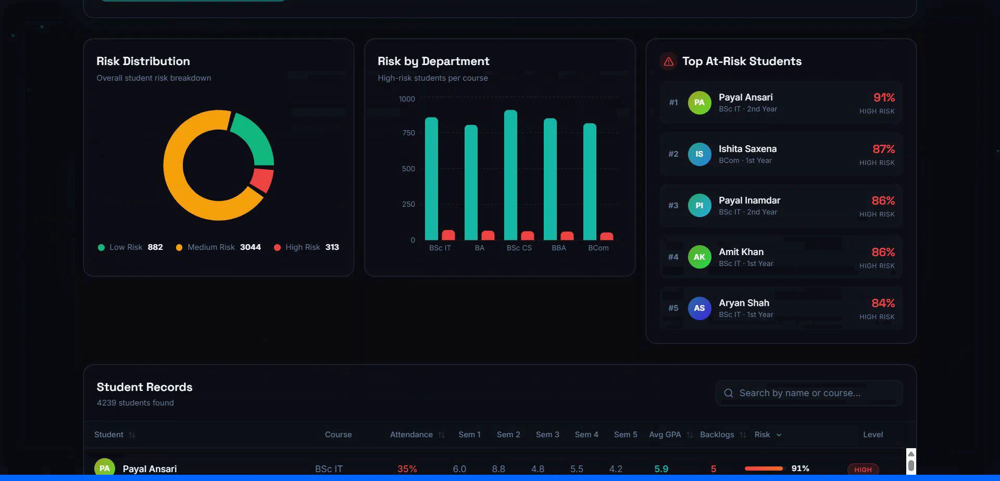

# Student Retention Risk Prediction Dashboard 🎓

## 🚀 Overview
Built a full-stack machine learning system to predict student dropout risk (churn prediction) and visualize insights through an interactive dashboard.

The system helps identify at-risk students early, enabling proactive intervention to improve retention.

**Key Highlights:**
- End-to-end pipeline: data → model → API → dashboard
- Real-time risk prediction using Random Forest
- Interactive visualizations for decision-making
---

## Why We Built This

One of the biggest problems in higher education is that students who are at risk of dropping out often go unnoticed until it's too late. We wanted to build something that could help faculty identify struggling students early so they can step in and actually help.

This project lets you see each student's predicted dropout risk based on their attendance, GPA trends, backlogs, and event participation — all in one dashboard.

---

## What the Dashboard Can Do

- **Student Table** — Browse and search all student records with their academic info
- **Risk Prediction Engine** — Run a prediction for any individual student in real-time
- **GPA Trend Chart** — See how a student's GPA has changed across semesters
- **Attendance vs Risk Plot** — Visual correlation between attendance and dropout probability
- **Backlog Impact Analysis** — How backlogs affect dropout risk
- **Feature Importance Chart** — Which factors are driving the model's predictions

---

## 💡 Business Impact
- Enables early identification of at-risk students
- Helps institutions improve retention rates
- Supports data-driven decision making for academic interventions

-----

## Tech Stack

**Frontend**
- React + TypeScript
- Vite
- Tailwind CSS
- Recharts

**Backend**
- Python + Flask
- scikit-learn (RandomForestRegressor)
- pandas, numpy, joblib
- matplotlib (for evaluation plots during training)

**Deployment**
- Frontend → Vercel
- Backend → Render

---

## Machine Learning Model
Implemented a Random Forest Regressor to predict a continuous dropout risk score (0–1).

**Why Random Forest:**
- Handles mixed feature types effectively
- Robust against overfitting
- Provides feature importance for interpretability

### Features used for prediction
| Feature | Description |
|---|---|
| Attendance | % of classes attended |
| Avg GPA | Mean GPA across 5 semesters |
| Backlog Count | Number of pending backlogs |
| Has Backlog | Binary flag (0 or 1) |
| Event Score | Participation level (0–3 scale) |
| Gender | Encoded from form responses |
| Course | Encoded from form responses |
| Year | Current year of study |
| Age | Student age |

### Train / Test Split

We split the dataset 80/20 using scikit-learn's `train_test_split`:
- **3391 samples** for training
- **848 samples** for testing

This ensures the model is evaluated on data it has never seen during training.

### Model Performance
The model demonstrates high predictive performance with strong generalization on unseen data:

```
Training R²   : 0.9967
Testing  R²   : 0.9863
MAE           : 0.0096
RMSE          : 0.0152

5-Fold Cross Validation
CV R² Mean    : 0.9832
CV R² Std Dev : 0.0033
```

The small gap between training and testing R² (0.9967 vs 0.9863) tells us the model isn't overfitting badly. The cross-validation std dev of 0.003 means performance is consistent across different data splits.

---

## Project Structure

```
student-retention-risk-dashboard/
├── student_Dashboard/         # React frontend (Vite)
│   ├── src/                   # Components, hooks, API services
│   └── package.json
├── main.py                    # Model training script
├── app.py                     # Flask API server
├── Student_Data.csv           # Raw dataset
├── display_student_data.csv   # Cleaned dataset for dashboard display
├── processed_student_data.csv # Encoded dataset for ML predictions
├── student_retention_model.pkl # Trained Random Forest model
├── requirements.txt
└── README.md
```

---

## How to Run Locally

### 1. Clone the repository
```bash
git clone https://github.com/monishgulati/student-retention-risk-dashboard.git
cd student-retention-risk-dashboard
```

### 2. Set up the backend
```bash
pip install -r requirements.txt
```

If you want to retrain the model from scratch:
```bash
python main.py
```

Then start the Flask API:
```bash
python app.py
```
The server will run at `http://127.0.0.1:5000`

### 3. Set up the frontend
```bash
cd student_Dashboard
npm install
```

Create a `.env.development.local` file inside `student_Dashboard/` with:
```
VITE_API_URL=http://127.0.0.1:5000
```

Then start the dev server:
```bash
npm run dev
```
The dashboard will be available at `http://localhost:5173`

---

## Live Demo 🌐
**[Insert Deployed Vercel Link Here]**

---

### Dashboard Overview


### Student Risk Prediction


### Data Visualizations


---

## What We'd Improve Next

- Connect to a real college's student information system for live data
- Add a retraining pipeline so the model updates periodically as new data comes in
- Add login authentication so only authorized faculty can access the dashboard
- Experiment with other models like XGBoost or LightGBM to compare performance
